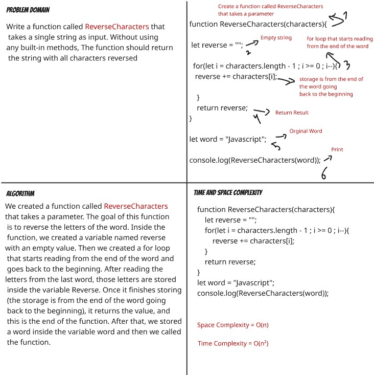

# Reverse Characters

## Challenge Description 
Write a function `ReverseCharacters` that takes a single string as input. Without using any built-in methods, the function should return the string with all characters reversed.

## Code 
function ReverseCharacters(characters){  // function called ReverseCharacters accepts paramter
    let reverse = "";          // empty string
    for(let i = characters.length - 1 ; i >= 0 ; i--){   // for loop read from the end and back to start
        reverse += characters[i];   // Storage in reverse 
    } 
    return reverse;  // return the result
}

let word = "Javascript";   // The Word 

console.log(ReverseCharacters(word));   

## Whiteboard

